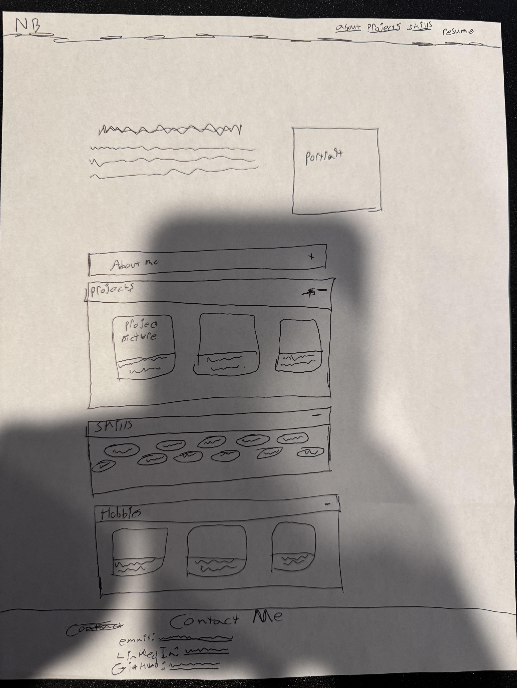

# NIck-B-Farmingdale.github.io
My personal portfolio web page.

QUESTIONS:
---------------------------------------------------------CONTENT/OVERVIEW:---------------------------------------------------------------------
1. What is your full name as you want it displayed professionally?
Nicholas Brennan

2. What is the purpose of your portfolio website?
To give people a practical look at my previous experience, showcase my technical skills, and just let people get to know me a little better.

3. Who is the target audience (employers, clients, peers, etc.)?
 Employers and peers

 4. What skills do you want to highlight?
Networking, Active Directory, Windows Server, Linux environments, hardware troubleshooting, and front-end web development (HTML5, CSS3, JavaScript).

5. What projects or work will yo showcase?
This project, a transportation service tracking application I made with a group last semester, and another group project where i helped design a hypothetical ai-tracked POS system for a hardware store.

6. How will you describe yourself in a short professional bio?
A customer-focused IT professional currently finishing a BS in Computer Programming and Information Systems. Utilizes over 3 years of experience working in roles which prioritize customer service and conflict resolution to provide simplified, efficient technical support.

7. . What pages will your site include (Home, About, Projects, Contact, etc.)?
The site is built as a seamless single-page application with distinct scrollable sections: Home (Hero), About, Projects, Skills, Hobbies & Interests, Frequently Used Resources, and a Contact footer.

8. What is your career goal or desired role?
My goal is to step into an entry-level help desk or system administrator position.

9. What technologies or tools do you have experience with?
Linux, Windows Server, Active Directory, Microsoft Excel, Microsoft Access, Git/GitHub, VS Code, HTML, CSS, and JavaScript.

10. What achievements or experiences are worth highlighting?
My Applied Associate of Science in IT, my current studies in the Computer Programming and Information Systems program at SUNY Farmingdale, and my practical experience navigating the Linux ecosystem (utilizing tools like the Arch Wiki and Lutris to optimize software on modern hardware).

11. What call-to-action should visitors take (contact you, view projects, download resume)?
Visitors should view my GitHub repositories via the project cards, download my PDF resume, and use the direct mailto: link in the footer to open an email draft to my address.

12. Will you include a resume? In what format?
Yes, as a viewable and downloadable PDF that opens in a new browser tab.

13. What social or professional links will you include (GitHub, LinkedIn, etc.)?
GitHub and LinkedIn, linked via styled buttons in the footer.

----------------------------------------------------DESIGN---------------------------------------------------------------------------------------------
1. What overall style will best represent you (minimalist, creative, professional, etc.)?
A clean, minimalist, and highly structured style.

2. What color scheme will you use and why?
A dark mode color scheme. Using a deep charcoal background (#121212) with lighter grey surfaces (#1e1e1e) reduces eye strain, while a vibrant blue accent color (#4da6ff) ensures interactive elements pop. I'm using it because simplistic and informational is more my style and I personally hate having to browse bright web pages, they hurt my eyes.

3. What fonts will you use for headings and body text?
Montserrat for bold, clear headings, and Open Sans for highly readable body text.

4. How will your design reflect your personality or field?
It will be straight-forward, informational, and highly organized.

5. What layout will your homepage follow?
A top-down flow starting with a vanishing sticky navigation bar, leading into a Hero section featuring a circle-cropped headshot. Information is packed efficiently using HTML 
 accordions for my background, CSS Flexbox for pill-shaped skill tags, and horizontal scrolling tracks for hobbies.

6. How will you organize project sections visually?
Projects are organized using CSS Flexbox/Grid into card-based layouts. Each card contains a responsive 16:9 screenshot of the project, a title, a description, and a clear call-to-action button linking to the GitHub repository.

7. Will the site be mobile-friendly? How will you ensure responsiveness?
Yes. The site was built strictly using a "mobile-first" methodology. Base CSS rules establish a single-column layout for phones, while @media (min-width: 768px) queries progressively enhance the layout into multi-column grids for wider desktop displays.

8. What visual hierarchy will guide visitors?
Large, distinct Montserrat section headings break up the content. The blue accent color acts as a guide, drawing the user's eye exclusively to clickable elements (links, buttons, and hover borders).

9. How will consistency be maintained across pages? 
By utilizing global CSS variables (:root) for all background, text, and accent colors, allowing for uniform padding/margins on all section containers, and applying standard border curves to all cards and images.

10. How will accessibility be considered (contrast, font size, readability)?
High contrast between the off-white text and dark grey background ensures readability. The site uses semantic HTML5 tags (<main>, <section>, <nav>) for screen readers, and maintains a minimum base font size of 16px with a generous 1.6 line height.

11. Will you use icons, images, or illustrations? Why?
Yes I will use a professional headshot to help create a personal connection, project screenshots to provide proof of work, and official media artwork (box art for games, album covers, and movie posters like RoboCop) to create a highly visual, engaging hobbies section without relying on walls of text.

12. What portfolio websites inspired your design?
Shiwlee Rahman's portfolio, combined with the horizontal-scroll UI patterns seen in modern applications like Steam and Netflix.

----------------------------------------------INTERACTIVITY-------------------------------------------------------------------------------------------

1. What interactive elements will your site include (navigation menus, buttons, forms)?
A sticky navigation menu, an expandable background accordion, hover-responsive project cards (which lift and cast shadows), horizontal swipe tracks for media, and CSS-styled action buttons.

2. Will your site include a contact form? How will it work?
No traditional form. Instead, the footer acts as the contact hub, utilizing a direct mailto: protocol link that automatically opens the user's default email client.

2. What JavaScript features will you implement?
A custom vanilla JavaScript event listener that tracks window.scrollY to determine the user's scroll direction. It dynamically adds or removes a CSS class to hide the navigation bar when scrolling down to save screen space, and slides it back when scrolling up

4. How will users receive feedback from interactions?
Through smooth, 0.3-second CSS transitions. Hovering over buttons inverts their colors, while hovering over project or resource cards causes them to slightly translate on the X or Y axis and illuminate with a colored border, instantly signaling clickability.

5. How does interactivity improve the user experience?
It's more engaging to see elements on a page animate because when the page actually responds to your actions it makes the website feel alive. This is the difference between having a webpage portfolio like this and just having a static resume.

----------------------------------------------WIREFRAME DESIGN:---------------------------------------------------------------------------------------

-------------------------------------------------------------DEVELOPMENT TIMELINE:------------------------------------------------------------------------
3/7/26:
1. Added basic framework for my site: color scheme, nav-bar (non-functional), and some accordion page elements. I also made it so the + on each accordion element turns into a - sign when the relevant content is already being displayed

2. Added headshot to home page and used "border-radius" css to turn the picture into a circle and "object-fit: cover;" to make sure the image doesn't stretch at all.

3. Added foundational html for the projects section. I went with a "project card" system which will showcase screenshots of my projects along with descriptions of each held inside one card element.

4. Project section is now functional and significantly more fleshed out, with screen space optimizations made for desktop where the project cards will display in two columns instead of the one on mobile.

3/8/26:
1. Updated the projects section so that any odd projects will appear centered in the second column on desktop instead of leaving an empty space this was mainly done by switching projects-grid from display: grid to flex and applying justify-content: center;. The syntax makes less sense now but the projects section looks much better in my opinion.

2. I implemented some javascript which makes it so when a user scrolls down the the nav-bar will disappear, and show up again when they scroll up. I did this by adding an event listener that would constantly check when someone was scrolling up or down, and if they were, it would add the navbar to a new CSS class named .top-bar--hidden which essentialy subtracts the entire vertical height from the navbar, pulling it off-screen. The event listener also helps assess whether the cursor has even moved at all, and if not, remembers so that the navbar position behaves in a consistent way.

3/9/26:
1. I added my skills section in the form of "skill pills" with a spacong system similar to that of the project cards where odd or "orphan" pills will be centered.

4. spruced up my skills section a bit with a hover effect and color changes.

3/10/26:
1. Added my full hobbies section by putting my top 5 of games, music, and movies. I did this by either putting them each on a track system(mobile) or having a full 5 column layout for each interest (desktop) i used a card system similar to the project cards, but with much more emphasis on the image portion.

3/11/26:
1. Added footer containing my "Contact Me" section. It includes three buttons for different social network accounts (Email, Github, LinkedIn). It also contains a short blurb telling people that I'm currently looking for entry-level IT positions as well as a small copyright mark.

2. Added a sectionn unique to me: a section including resources that i frequently use in my personal life. I created 4 resource cards which themselves act as buttons, taking you to the resource when clicked. I also made it so that, when viewed on desktop, the resource cards will show up as a 2x2 grid.

--------END OF TIMELINE - PROJECT FINISHED--------

-------------------------------------------RESOURCES USED:----------------------------------------------------------------------

1. MDN Web Docs: Semantic HTML5
https://developer.mozilla.org/en-US/docs/Glossary/Semantics
https://developer.mozilla.org/en-US/curriculum/core/semantic-html/

2. CSS-Tricks: A Complete Guide to Flexbox
https://css-tricks.com/snippets/css/a-guide-to-flexbox/

3. MDN Web Docs: CSS Custom Properties (Variables): Referenced for setting up the global dark-mode color scheme (:root) to maintain visual consistency across all CSS rules.
https://developer.mozilla.org/en-US/docs/Web/CSS/Guides/Cascading_variables/Using_custom_properties

4. Google Fonts
https://fonts.google.com/

5. Shiwlee's website - Took a lot of inspiration from this website for my skills section.
https://shiwlee2019.github.io/portfolio.github.shiwleeR/index.html